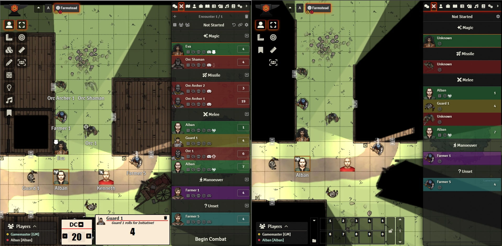
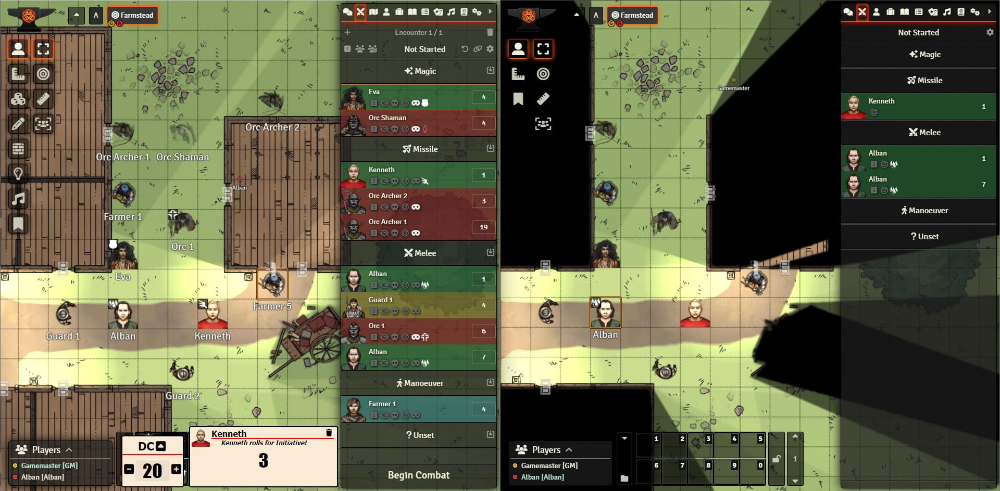
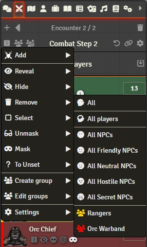
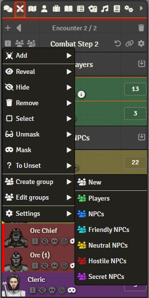
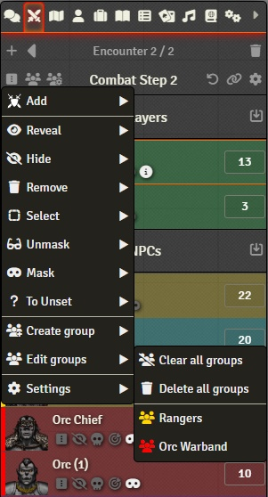
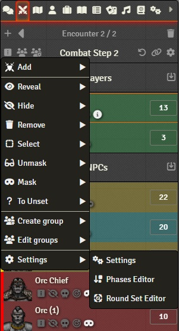
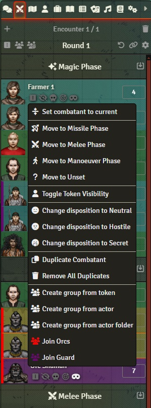
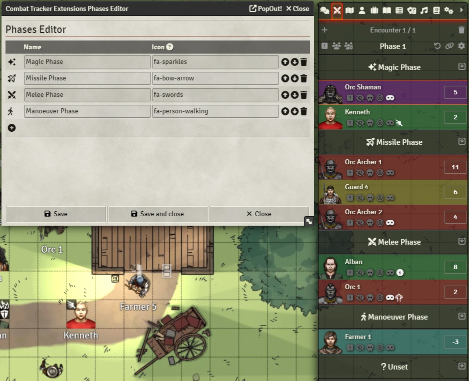

 

# Combat Tracker Extensions

A system-agnostic FoundryVTT module for modifying and extending the standard Combat Tracker.
Adds features to the standard Combat Tracker like name hiding, hide/obscure initiative/combatant based on type/disposition/visibility/ownership, reverse initiative order, groups, group initiative, custom combat phases, multiple combatants for the same token, display token dispositions and many more.

## Feature Summary

- All features optional, configurable and works together
- Combatant Groups
  - With or without Shared Initiative(Group Initiative) 
  - Quick shortcuts for creating groups
  - Selectable group leader
  - Shows combatant group/shared initiative by color indication
- Custom defined combat phases
  - Allow players to change phase for owned tokens
- Custom defined round set
- Reverse initiative order
- Multiple combatants for the same token
- Obscure(hide) combatant information/entry for non-GMs in/on: 
  - Combat Tracker

    - Combatant and/or combatant initiative value based on
      - Module current settings
      - NPC/Player token
      - Token disposition
      - Token current visibility for current player
      - Token ownership

    - Combatant name
      - Combatant name masking - hides token name in Combat Tracker from non-GMs
      - Option to automatically set added combatants to name masked

    - Combatant visibility(not to be confused with token visibility)
      - Option to automatically set added combatants to hidden

    - Combatants Active Effects for tokens on the Combat Tracker

  - Canvas(scene)
    - Token Active Effects
    - Token Borders

- Show information in Combat Tracker(for GMs and/or Players)
  - Combatant disposition by color indication
  - Show token actor portrait instead of token portrait

- Change token disposition/visibility from Combat Tracker
- Quick input field to modify current initiative value
- Pan to token in Combat Tracker for players
- Select, pan and zoom to type/group combatants for GMs
- Add tokens from scene based on token type and/or disposition

### Queries, bugs, suggestions, comments?

[Ramses800(Ramses800#8517)@Foundry Discord Server](https://discordapp.com/users/783401137281564692)

[Discussion on GitHub](https://github.com/Anderware/Combat-Tracker-Extensions/discussions)

## Combat Tracker Extensions Basic User Interface

Depending on current module setting, various interface elements are added/displayed.

## Demo screens

### Demo screen 1 - Obscuring player´s Combat Tracker

In the screenshot below, a scenario with all module options enabled, to the left is the GMs screen, to the right is the Alban´s player screen.
Alban´s player can not see Orc Shaman(invisible) or Orc Archer 2(blocked line of sight), he can not see any other tokens/combatants active effects or the name of masked combatants. The token Eva has disposition of SECRET and therefore her initiative is hidden from Alban.
Alban has also been granted a second action(duplicated combatant).

### Demo screen 2 - Obscuring player´s Combat Tracker

In this scenario, Alban´s player can only see other players that has a FRIENDLY disposition

### Demo screen 3 - Obscuring player´s Combat Tracker

Same scenario as demo 2 but with phases disabled

## Dropdown menus

All menus available content is controlled by the module current settings

### Encounter Control Dropdown Menu

If any options are enabled, a command button is added to the Encounter Controls

#### Token Commands

- Add - for adding tokens on the canvas matching selection type to the current encounter. 
  If the token is already in the encounter as a combatant, its current state(visibility, initiative,phase etc) is kept as is(it will not be added again).

#### Combatant Commands

- Reveal - will make combatants visible in players Combat Tracker(if not hidden by other settings)
- Hide - will make combatants hidden in players Combat Tracker
- Remove - will remove combatants from encounter
- Select - will select combatants tokens on the canvas and pan and zoom to fit them on screen
- Unmask - will make combatants name show in players Combat Tracker
- Mask - will hide combatants name in players Combat Tracker
- To Unset - will move combatants to the Unset phase

For each command, a sub dropdown menu will open with the following selections possible

- All - the command will affect all combatants in the current encounter
- All players - the command will only affect player combatants in the current encounter
- All NPCs  - the command will only affect all NPCs combatants in the current encounter
- All Friendly NPCs - the command will only affect NPCs combatants with a Friendly disposition in the current encounter
- All Neutral NPCs - the command will only affect NPCs combatants with a Neutral disposition in the current encounter
- All Hostile NPCs - the command will only affect NPCs combatants with a Hostile disposition in the current encounter
- All Secret NPCs - the command will only affect NPCs combatants with a Secret disposition in the current encounter
- If Groups is used, any groups will also added.

#### Group Commands

##### Create group

###### Create new group

Create a new group with no members

###### Create group from type

Creates a group based on all combatants of that type. If group already exist, it will be updated

- Players
- NPCs
- Friendly NPCs
- Neutral NPCs
- Hostile NPCs
- Secret NPCs

##### Edit groups

###### Clear all groups

This will remove all members from all existing groups without deleting any groups.

###### Delete all groups

This will remove all members from all existing groups and delete all groups.

###### [group name]

Opens the group editor form for selected group

See sections on Groups for more information

#### Setting Commands

The Encounter Control Dropdown also have shortcuts to 

- Module settings
- If Round Set is enabled, the Round Set Editor can be opened from here
- If Phases is enabled, the Phases Editor can be opened from here

### Combatant Dropdown Menu

#### Group Commands

##### Ungrouped combatant

###### Create group from token

Creates group from selected token and joins all combatants with this token to the created group.  The combatant that triggered the group creation will be added first to the group and designated group leader.
If the group already exist, it will be updated.

###### Create group from actor

Creates group from selected actor and joins all combatants with this actor to the created group. The combatant that triggered the group creation will be added first to the group and designated group leader.
If the group already exist, it will be updated.

###### Create group from actor folder

Creates group from selected actor folder and joins all combatants with actors in the same folder to the created group. The combatant that triggered the group creation will be added first to the group and designated group leader. 
If the folder has a color, the group will use that color.
If the group already exist, it will be updated.

###### Join [group name]

Joins the selected combatant to the group

##### Grouped combatant

###### [group name]

Opens the group editor form for selected group

###### Set as group leader

Make selected combatant group leader

###### Leave [group name]

This will set the combatant to ungrouped.

### Phase Assignment

Each phase has a command control that can assign(move) a selection of combatants to it.

##### Random from Unset

This will take a random combatant from the Unset phase. 

Combatants in a group that shares the initiative and option for Phase sharing enabled, will be handled as a single combatant and if selected by the random dice, all members of that group will be assigned to the same phase.

### Effect summary tooltip

If a combatant has more active effects than can be displayed in the combat tracker, all effects will be replaced by a summary icon. This icon has a tooltip that displays all effects.

## Module Compatibility

Foundry version 10, 11

## Module Definitions

This module uses two definitions that can be confusing, **Round Set** and **Phases**. The actual label for these functionalities differs between RPG systems but for the module functionality these are the definitions used. Round Set and Phases can be enabled at the same time.

### Round Set

A Round Set is a set of Foundry rounds, meaning you can define phases, segments or whatever your system call them and have the combat tracker go from one round to another and start again with the first round.

Use the Round Set Editor found in the module´s Configure Game Settings or, when Round Set is enabled, the Encounter Control Dropdown, to define custom rounds.

### Phases

A Phase is a part of a Foundry round. This feature divides the Foundry round into phases which each has its own initiative order. Combatants is assigned to a phase. You can use any naming for phases, it could be like in the example below  or just "Players", "Enemies", "Allies" etc.

A "Unset" phase is always added to the defined phases and will be the default phase a combatant is assigned to when added to an encounter. 
The name displayed for the Unset phase can be changed in settings.

Use the Phase Editor found in the module´s Configure Game Settings or, when Phases is enabled, the Encounter Control Dropdown, to define custom phases.

### Combatant Groups

Groups comes in two major flavors, groups that shares initiative and groups that does not share initiatives.

The first combatant added to a group will be designated the default group leader, this can be changed later with the combatant dropdown menu command **Set as group leader**.

Groups are only visible to GMs.

#### Non-sharing groups

Indicated by a dashed left border.

Combatants in a non-sharing group are treated as any other combatant. The grouping is merely a logical extension to be used for helping the GM to keep gangs/bands/strike teams etc. together and use overall commands like Mask/Unmask/Reveal/Select etc.

#### Initiative sharing groups

Indicated by a solid left border

Combatants in a sharing group is handles as a single combatant, if initiative (or phase if option is checked) is changed for one combatant in the group, the others are updated to match.

The group leader´s initiative will be used for **Roll All**/**Roll NPC** commands and also the sorting in Combat Tracker and Group Editor

## Module Settings

## Module Settings
### General Options
General options
#### Reverse initiative
Reverse the sorting order for initiative so that lowest goes first.
#### Enable round set
Enables custom defined round set for the combat tracker. Each round in the round set has its own phases.
### Commands Options
Basic command(dropdown) options
#### Enable base menu commands
Enable base dropdown menu commands.
#### Enable visibility toggle
When checked, GMs can toggle visibility of the combatant token in the Combat Tracker.
#### Enable pan to token for non-GMs
When checked, players can click a combatant in Combat Tracker and the canvas will pan to its token.
#### Duplicate combatant
Add a 'Duplicate Combatant' dropdown menu item in the Combat Tracker that allows each token to have multiple combatants to give the possibility to get multiple actions in the same round.
#### Enable disposition change
Adds dropdown menu items in the Combat Tracker that allows for changing the disposition of a combatant token. Applies for GMs only.
### Phases Options
Options for Phases
#### Enable phases
Enables custom defined phases for the combat tracker. Each phase has its own initiative order. Adds dropdown menu items in the Combat Tracker that allows for changing the phase of a combatant token. 
#### Unset phase name
The name(caption) to be shown for the Unset phase
#### Enable change phase for non-GMs
When checked, players can change phase in Combat Tracker for owned combatants
#### Default phase for players
When adding a player token to combat, it will be added to this phase.(First phase is 0)
#### Default phase for NPCs
When adding a NPC token to combat, it will be added to this phase.(First phase is 0)
#### Enable phase assignment random
When checked, the Phase Assignment dropdown will have a entry for randomly selecting a unset combatant.
### Group Options
Options for combatant groups
#### Enable combatants groups
Enable grouping of combatants.
#### New groups shares initiative
When checked, new groups will be created with Shared Initiative enabled as default. Only used if [Enable combatants groups] is enabled
#### Sharing Groups also share phase
When checked, combatants in a group that shares inititative also share phase. Only used if [Enable combatants groups] is enabled
### Input Options
Initiative input options
#### Initiative input field
Replace the normal initiative value with a number input field.
#### Minimum initiative input allowed
The minimum number that can be entered into the initiative input field.
#### Maximum initiative input allowed
The maximum number that can be entered into the initiative input field.
### Display Options
General display options
#### Use actor portraits for GMs
When checked, the Combat Tracker will use the token actors portrait as image instead of the token image. Applies for GMs only.
#### Use actor portraits for players
When checked, the Combat Tracker will use the token actors portrait as image instead of the token image. Applies for non-GMs only.
#### Show combatant effect tooltips
When checked, combatants active effects in Combat Tracker will have a describing tooltip. If not all effects can be showed, a summary icon with a full list as tooltip replaces all effect icons.
#### Show disposition for GMs
When checked, the Combat Tracker will indicate by color the disposition of the combatant. Applies for GMs only.
#### Show disposition for players
When checked, the Combat Tracker will indicate by color the disposition of the combatant. Applies for non-GMs only.
### Obscuring Options
Options for obscuring combatant information for players. Owned tokens are never obscured
#### Enable obscure combatant
When checked, the Combat Tracker will display combatants/information based on module settings and ownership. Applies for non-GMs only.
#### Obscure combatant by visibility
When checked, the Combat Tracker will only display combatants that has token visible for the user. Only used if [Enable obscure combatant] is checked. Applies for non-GMs only.
#### Obscure combatant by disposition
When checked, the Combat Tracker will display combatants/information for tokens based on their disposition and current settings. Only used if [Enable obscure combatant] is checked. Applies for non-GMs only.
#### Add NPC combatants as hidden
When checked, adding a NPC token to the Combat Tracker will be added as hidden.
#### Enable name masking
When checked, GMs can toggle masking the name of combatants for non-GMs in the Combat Tracker.
#### Add NPC combatants with name masked
When checked, adding a NPC token to the Combat Tracker will have its name masked for non-GMs. Only used if[Enable name masking] is checked.
#### Hide combatant effects for non-GMs
When checked, combatants active effects in Combat Tracker will only be showed for owned tokens.
#### Hide token effects for non-GMs
When checked, token active effects on the Canvas will only be showed for owned tokens.
#### Hide token border for non-GMs
When checked, token border on the Canvas will only be showed for owned tokens.
#### Hide FRIENDLY combatants initiative
If checked, combatants with FRIENDLY token disposition will not show their initiative value in the Combat Tracker. Only used if [Enable obscure combatant] is checked. Applies for non-GMs only.
#### Hide NEUTRAL combatants initiative
If checked, combatants with NEUTRAL token disposition will not show their initiative value in the Combat Tracker. Only used if [Enable obscure combatant] is checked. Applies for non-GMs only.
#### Hide HOSTILE combatants initiative
If checked, combatants with HOSTILE token disposition will not show their initiative value in the Combat Tracker. Only used if [Enable obscure combatant] is checked. Applies for non-GMs only.
#### Hide SECRET combatants initiative
If checked, combatants with SECRET token disposition will not show their initiative value in the Combat Tracker. Only used if [Enable obscure combatant] is checked. Applies for non-GMs only.
#### Hide players combatants initiative
If checked, player combatants will not show their initiative value in the Combat Tracker. Only used if [Enable obscure combatant] is checked. Applies for non-GMs only.
#### Hide FRIENDLY combatants
If checked, combatants with FRIENDLY token disposition will not be shown in the Combat Tracker. Only used if [Enable obscure combatant] is checked. Applies for non-GMs only.
#### Hide NEUTRAL combatants
If checked, combatants with NEUTRAL token disposition will not be shown in the Combat Tracker. Only used if [Enable obscure combatant] is checked. Applies for non-GMs only.
#### Hide HOSTILE combatants
If checked, combatants with HOSTILE token disposition will not be shown in the Combat Tracker. Only used if [Enable obscure combatant] is checked. Applies for non-GMs only.
#### Hide SECRET combatants
If checked, combatants with SECRET token disposition will not be shown in the Combat Tracker. Only used if [Enable obscure combatant] is checked. Applies for non-GMs only.
#### Hide NPCs combatants
If checked, NPC combatants will not be shown in the Combat Tracker. Only used if [Enable obscure combatant] is checked. Applies for non-GMs only.
#### Hide non-NPCs combatants
If checked, non-NPC combatants will not be shown in the Combat Tracker. Only used if [Enable obscure combatant] is checked. Applies for non-GMs only.

## Module background

As some may know, I am the current developer of the system building Foundry System [Sandbox](https://foundryvtt.com/packages/sandbox)

Sometime we make the occasional system with Sandbox that has some other way of handling initiatives so when I the other week went to look for a module to have different combat phases with reversed initiative order, I could not find anything that suited my needs. Being a Foundry programmer, I just thought to myself. "Hey, that cant be so hard to throw something together".  So, I started writing a module for it and of course, other ideas/functions crept in and turned that into a larger thing than originally intended. And thus, the "Combat Tracker Extensions" was born.

## Source code used

Combat Tracker Extension is built on a base from  [Reverse Initiative Order](https://github.com/sun-dragon-cult/fvtt-module-reverseinitiativeorder) by [Åke Wivänge](https://github.com/wake42)

## License

Module development according to Foundry Virtual Tabletop [Limited License Agreement for Module Development](https://foundryvtt.com/article/license)

This module is licensed by [Ramses800](https://github.com/Anderware/Foundry-Vtt-Sandbox-Macros) under [AGPL-3.0](https://opensource.org/licenses/AGPL-3.0)
